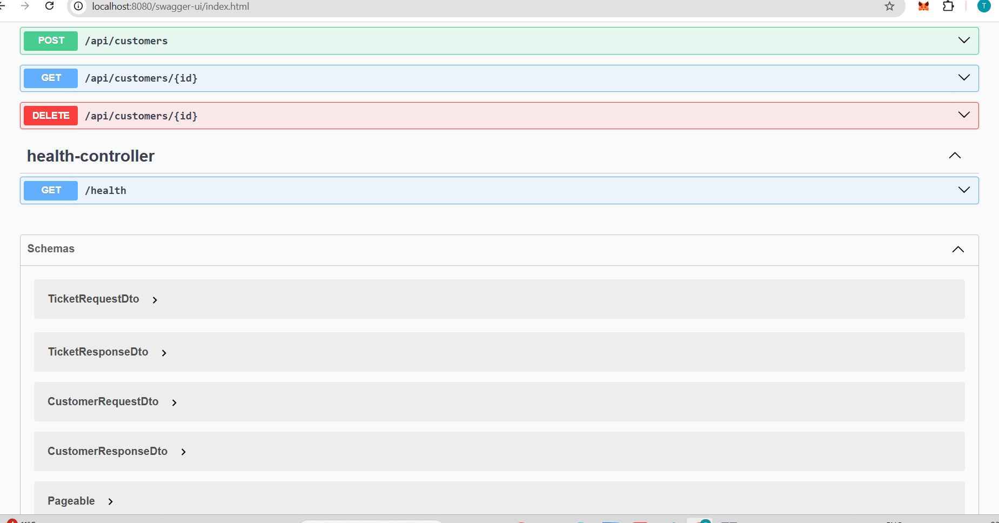

# 🛠️ Customer Care API

A **production-ready Spring Boot REST API** that simulates a **Customer Care / Ticket Support system**.
This project is designed to demonstrate **clean backend architecture**, **real-world API design**, and **industry best practices**.

---

## 🚀 Why this project?

This project answers common real-world backend requirements:

* Manage customers
* Raise & track support tickets
* Maintain clean separation using DTOs & Services
* Auto-generated API documentation using Swagger
* Ready for deployment and extension

👉 Built to be **interview-ready**, **scalable**, and **easy to understand**.

---

## 🧩 Features

### 👤 Customer Management

* Create a new customer
* Fetch all customers
* Fetch customer by ID
* Prevent duplicate customers using email

### 🎫 Ticket Management

* Create support tickets for customers
* Track ticket status and priority
* Associate tickets with customers

### 📘 Swagger API Documentation

* Interactive UI to test APIs
* Request / Response schemas visible
* No external tool required

---

## 🏗️ Tech Stack

| Layer           | Technology                  |
| --------------- | --------------------------- |
| Language        | Java 17                     |
| Framework       | Spring Boot                 |
| API Style       | REST                        |
| ORM             | Spring Data JPA (Hibernate) |
| Database        | H2 (In-memory)              |
| Documentation   | Swagger / OpenAPI           |
| Build Tool      | Maven                       |
| IDE             | Eclipse                     |
| Version Control | Git & GitHub                |

---

## 📂 Project Structure

```
customercare-api
 ├── controller        → REST Controllers
 ├── service           → Business logic interfaces
 ├── service.impl      → Business logic implementation
 ├── repository        → Database access layer
 ├── entity            → JPA entities
 ├── dto               → Request & Response DTOs
 ├── mapper            → Entity ↔ DTO mapping
 ├── exception         → Global exception handling
 └── config            → Swagger & app configuration
```

This follows **industry-standard layered architecture**.

---

## 🔌 API Endpoints (Sample)

### Customer APIs

| Method | Endpoint              | Description         |
| ------ | --------------------- | ------------------- |
| POST   | `/api/customers`      | Create new customer |
| GET    | `/api/customers`      | Get all customers   |
| GET    | `/api/customers/{id}` | Get customer by ID  |
| DELETE | `/api/customers/{id}` | Delete customer     |

### Ticket APIs

| Method | Endpoint       | Description     |
| ------ | -------------- | --------------- |
| POST   | `/api/tickets` | Create a ticket |
| GET    | `/api/tickets` | Get all tickets |

---

## 📘 Swagger UI Preview

🔹 Swagger API Overview


 🔹 Create Customer & Ticket API



## ▶️ How to Run Locally

### 1️⃣ Clone Repository

```bash
git clone https://github.com/your-username/customercare-api.git
cd customercare-api
```

### 2️⃣ Run Application

```bash
mvn spring-boot:run
```

### 3️⃣ Access Swagger

```
http://localhost:8080/swagger-ui/index.html
```

---

## 🧪 Example Request

### Create Customer

```json
{
  "name": "Tripti Chaturvedi",
  "email": "tripti@gmail.com",
  "phone": "9999999999"
}
```

---

## ⚙️ Configuration

* **H2 Console**: (for local testing)

```
http://localhost:8080/h2-console
```

* No external DB required
* Ready to switch to PostgreSQL / MySQL

---

## 🌍 Deployment

This project is **deployment-ready** and can be hosted on platforms like:

* Render
* Railway
* AWS (EC2 / Elastic Beanstalk)

(Deployment instructions can be added easily.)

---

## 🧠 What This Project Demonstrates

✅ REST API Design Principles
✅ Clean Code & Layered Architecture
✅ DTO Pattern (No entity leakage)
✅ Swagger Documentation
✅ Git & GitHub workflow

---

## 🔮 Future Enhancements

* JWT Authentication & Role-based Access
* Pagination & Sorting
* Global Exception Handling Enhancement
* Dockerization
* PostgreSQL Integration
* Unit & Integration Tests

---

## 👩‍💻 Author

**Tripti Chaturvedi**
Software Engineer | Backend Developer

📧 Email: [triptichaturvedi49@gmail.com](mailto:triptichaturvedi49@gmail.com)
🔗 GitHub: [https://github.com/tripti202](https://github.com/tripti202)

---

## ⭐ If you like this project

Give it a ⭐ on GitHub — it helps a lot!

---

> 💡 *This project was built to reflect real-world backend engineering practices and interview-level expectations.*
